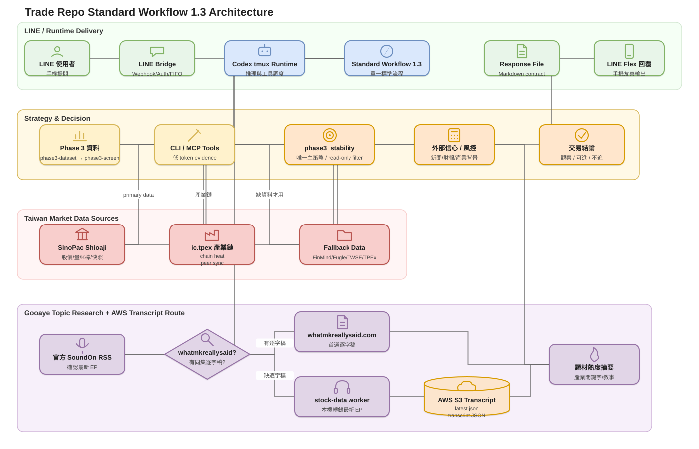
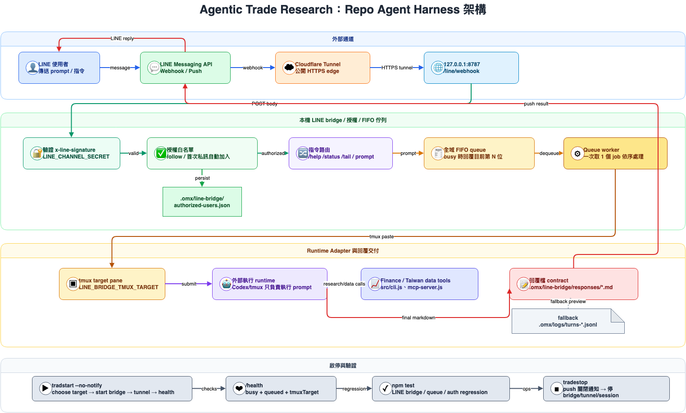

# Agentic Trade Research

這是一套把 LINE 指令入口、授權白名單、FIFO 任務佇列、tmux runtime adapter 與財經 MCP/CLI 工具串成一條本機 agent workflow 的研究 harness。

重點：

- **Codex 負責分析與推理**：使用你現有的 Codex / ChatGPT 額度。
- **本 repo 負責 agent harness 與資料工具**：把 LINE webhook、授權、排程、tmux runtime adapter、MCP/CLI 金融資料工具與 LINE Flex Message 回覆交付串成可運作的本機 agent workflow。
- **低 token evidence pipeline**：MCP 預設 `compact-json`，並提供 `research-pack`、`outputFields`、`maxRows`，讓 agent 讀到精簡但可追溯的資料輸出。
- **Repo-native dynamic memory**：`memory-sync` 會把可長期保存的決策、驗證修復、失誤復盤與里程碑分層寫入 `.omx/memory/hot.md`、`warm.md`、`archive.md`、`obsolete.md`，避免每次 session 載入過期脈絡。


## Standard Workflow 1.4

目前 repo 的標準流程來源是 [`docs/standard-workflow-v1.md`](docs/standard-workflow-v1.md)。若舊對話、舊 backtest 或舊策略名稱與該文件衝突，以 Standard Workflow 1.4 為準。正式主流程入口是 `taiwan-agent-team`，由同一個可稽核 orchestrator 依使用者意圖切換篩選或指定股票分析。

標準版只保留：

- 唯一主策略：`phase3_stability`
- 唯一技術篩選入口：read-only `phase3-screen`
- 凍結門檻：HMA9 上升、HMA20 非負、收盤不低於 HMA9、距離不超過 6%、20 日平均成交額至少 2,000 萬、五日動能不超過 18%、收盤位置不超過 0.72
- 外部新聞、法說、財報與 ETF 籌碼只在技術候選成立後作信心加權
- `gooaye-topic-research` 會先核對官方 RSS，再讀取符合 as-of date 的股癌研究資料；完成後才執行 read-only DOM
- 最終候選必須揭露與股癌／當前題材的相符性；題材不符可撤下現行名單，但不竄改 Phase 3 歷史技術結果
- DOM 不進入 Phase 3 資料或候選資格
- DOM 有有效樣本時固定交付 `activeEntryLimit`、`patientEntryPrice`、`takeProfitPrice`、`stopLossPrice`；即使等待仍交付全部四個價格
- 不含預測模型、promotion workflow 或自動下單；使用者手動交易

```text
phase3-dataset → phase3-screen → company/industry/ETF research → gooaye-topic-research → phase3-dom-confidence → manual decision
```

只有使用者要求選股、股票篩選或候選名單時才執行 Phase 3；`screen` 模式只允許 eligible 候選進入外部研究與 DOM，零 eligible 候選會停止後續逐檔工具。指定股票的 `analyze` 模式不執行 Phase 3，並明確標示 `phase3Eligibility: not_evaluated`，直接完成市場情境、外部信心、DOM 與四個價格。

```sh
# 選股：Phase 3 → eligible-only 外部信心 → 股癌題材 → DOM → 四個價格
node src/cli.js taiwan-agent-team --query "篩選台股候選" --mode screen --format markdown

# 指定股票：不執行 Phase 3，直接研究 2330
node src/cli.js taiwan-agent-team --query "分析台積電" --mode analyze --tickers 2330 --format markdown
```

### 主策略的七個 Agent lane

| Agent | 責任 |
| --- | --- |
| `planner` | 判斷 `screen` / `analyze` 意圖、參數、階段順序與停止條件。 |
| `data-agent` | 盤點 repo 證據；只有 screen 模式才更新 point-in-time Phase 3 資料。 |
| `strategy-agent` | 只有 screen 模式呼叫 `phase3-dataset`、`phase3-screen`，並只交付 eligible 候選。 |
| `market-agent` | 讀取 Shioaji 指數/個股快照、盤前、類股資金流與 IC.TPEX peer context。 |
| `external-confidence-agent` | 整合公司、新聞、公告、財報、營收、估值、ETF 與股癌題材證據。 |
| `dom-agent` | 外部研究後讀取永豐 DOM，交付買賣壓力與四個人工參考價格。 |
| `verifier` | 稽核工具順序、錯誤、資料缺口、eligibility 邊界、redaction 與 read-only 安全。 |

```sh
node src/cli.js phase3-dom-confidence --ticker 2330 --format markdown
```

- 架構流程圖 source：[`docs/diagrams/standard-workflow-v1.drawio`](docs/diagrams/standard-workflow-v1.drawio)
- 架構流程圖 SVG：[`docs/diagrams/standard-workflow-v1.svg`](docs/diagrams/standard-workflow-v1.svg)



## 作品集版架構總覽：Repo-native Agent Harness

這個 repo 本身定義的是一組 **repo-native logical agents / harness modules**。它不把外部 Codex/OMX 的 agent/skill 當成專案內容，而是提供一個可由手機操作、可授權、可排隊、可呼叫金融資料工具、可交付 Markdown 結果的本機 agent workflow harness。

主要資料流：

1. **Message Intake Agent** 接收 LINE webhook，驗證簽章並解析使用者訊息。
2. **Authorization Agent** 透過 LINE friend / userId 本機白名單控管可操作者。
3. **Command Router Agent** 區分 `/help`、`/status`、`/tail` 與一般 prompt。
4. **FIFO Scheduler Agent** 在多使用者同時送 prompt 時排隊，回覆目前第 N 位，避免遺失任務。
5. **Runtime Adapter Agent** 把排程後的 prompt 安全送進指定 tmux pane，讓外部 Codex runtime 執行。
6. **Finance Data Tool Agent** 以 MCP/CLI 方式提供美股、台股、新聞、公告、財報、估值等低 token evidence。
7. **Response Dispatcher Agent** 讀取 response-file contract 或 fallback turn log，將結果轉成 LINE Flex Message 後 push 回原 LINE 使用者，避免 Markdown 表格在手機訊息框跑版。
8. **Ops Supervisor** 負責 `tradestart` / `tradestop`，管理 bridge process、Cloudflare tunnel、tmux target 與 runtime state。

架構圖 PNG：[`docs/diagrams/trade-line-bridge-workflow.png`](docs/diagrams/trade-line-bridge-workflow.png)  
架構圖 source：[`docs/diagrams/trade-line-bridge-workflow.drawio`](docs/diagrams/trade-line-bridge-workflow.drawio)



### Repo 內的 agent / harness modules

> 這裡的「agent」指本 repo 內負責一段自主流程的 logical agent/module；不是外部 OMX/Codex native agent 定義。

| Repo logical agent / module | 主要檔案 | 責任 |
| --- | --- | --- |
| Message Intake Agent | `src/line-bridge.js` | 建立 LINE webhook server、驗證 `x-line-signature`、解析 LINE text/follow events |
| Authorization Agent | `src/line-bridge.js`, `.omx/line-bridge/authorized-users.json`（runtime ignored） | 自動授權加入好友/首次私訊使用者、維護本機白名單、拒絕未授權來源 |
| Command Router Agent | `src/line-bridge.js` | 處理 `/help`、`/status`、`/tail`、未知指令與一般 prompt |
| FIFO Scheduler Agent | `src/line-bridge.js` | global FIFO queue、busy 狀態、排隊順位回覆、依序啟動 job |
| Runtime Adapter Agent | `src/line-bridge.js`, `src/line-bridge-auto.js` | 選擇/確認 tmux target，透過 tmux paste/send-keys 把 prompt 送進外部執行 runtime |
| Response Dispatcher Agent | `src/line-bridge.js` | 產生 response-file contract、等待 `.omx/line-bridge/responses/*.md`、fallback 到 `.omx/logs/turns-*.jsonl`、將 Markdown/表格轉成 LINE Flex Message 並切分 push 訊息 |
| Finance Data Tool Agent | `src/mcp-server.js`, `src/tools.js`, `src/cli.js` | expose MCP `tools/list` / `tools/call` 與 CLI，提供 `research-pack`、台股/美股資料、低 token render controls |
| Market Data Connectors | `src/financial-datasets.js`, `src/taiwan-market.js` | 封裝 Financial Datasets、FinMind、TWSE、TPEx、Fugle 等外部資料來源 |
| Ops Supervisor | `src/tradstart.js`, `src/tradstop.js`, `src/trade-runtime.js`, `bin/tradestart`, `bin/tradstart` (legacy alias), `bin/tradestop` | 啟停 LINE bridge、Cloudflare tunnel、tmux target/session，寫入/清理 runtime state |
| Research Workflow Templates | `workflows/*.md` | repo-native 投資研究流程模板：美股 memo、台股 memo、DCF、新聞敘事 triage |
| Regression Harness | `tests/*.test.js` | 驗證 CLI、MCP、LINE bridge、授權、FIFO queue、tmux target 選擇、runtime state |

### 外部 runtime 邊界

- **Codex / ChatGPT / OMX 不屬於本 repo 的 agent 實作**；它們是這個 harness 可以驅動的外部推理 runtime。
- 本 repo 的責任是把任務可靠送進 runtime、提供資料工具、保存/交付結果、並用 tests 確保流程可回歸。
- `.env`、`.omx/**`、LINE 白名單、回覆檔、logs、runtime state 都是本機 runtime artifacts，已由 `.gitignore` 排除，不進 GitHub。

### Harness 工程亮點

- **LINE → runtime 的可靠交付**：`src/line-bridge.js` 驗簽、授權、排隊、注入 response-file contract，避免 LINE push 回覆被截斷或混線。
- **LINE 友善排版**：完成回覆會以 Flex Message bubble 推送；Markdown 表格會拆成 Flex row，降低中文欄位在 LINE 訊息框跑版的機率。
- **多使用者短期佇列化**：global FIFO queue 讓多位使用者同時送 prompt 時會排隊，不會直接拒絕或遺失訊息。
- **可重啟的 ops harness**：`src/tradstart.js` / `src/tradstop.js` 管理 tmux target、bridge process、Cloudflare tunnel 與 runtime state；`tradestart` 啟動前會清理過期 LINE responses、OMX logs、舊 resume/session state 與 smoke temp；啟動/關閉預設不廣播通知所有 LINE 使用者，需要時加 `--notify` 明確 opt-in。
- **低 token MCP 工具層**：`src/mcp-server.js` 預設 `compact-json`，支援 `outputFields` / `maxRows` / `research-pack`，把「壓縮輸出」和「保留資料覆蓋」分開。
- **驗證導向**：`tests/*.test.js` 覆蓋 CLI、MCP、LINE bridge、授權、queue、tmux target 選擇與 runtime state。

## 設定 `.env`

```env
# 美股 / Financial Datasets 指令需要
FINANCIAL_DATASETS_API_KEY=your-key
FINANCIAL_DATASETS_BASE_URL=https://api.financialdatasets.ai

# FinMind 台股資料，可選；沒填也能用較低免費額度
FINMIND_API_TOKEN=your-token
FINMIND_BASE_URL=https://api.finmindtrade.com

# TWSE / TPEx 官方 OpenAPI base URL，可選，通常不用改
TWSE_OPENAPI_BASE_URL=https://openapi.twse.com.tw/v1
TPEX_OPENAPI_BASE_URL=https://www.tpex.org.tw/openapi/v1

# Fugle 台股即時 / 盤中資料需要
FUGLE_API_KEY=your-fugle-key
FUGLE_MARKETDATA_BASE_URL=https://api.fugle.tw/marketdata/v1.0/stock

# 永豐 Shioaji 只讀行情工具需要先啟動本機 Shioaji server
SJ_API_KEY=
SJ_SEC_KEY=
SJ_CA_PATH=
SJ_CA_PASSWD=
SJ_PERSON_ID=
SHIOAJI_SERVER_BASE_URL=http://localhost:8080
SHIOAJI_SIMULATION=true
# 下單路徑預設關閉；只讀行情工具不需要開啟
TRADE_ORDER_ENABLED=0
TRADE_ORDER_CONFIRM=
```

## 怎麼搭配 Codex 使用？

你可以叫 Codex 先跑 CLI 抓資料，再用回傳資料做分析。

範例：

> 使用這個 repo 的 CLI 工具研究 2330。請抓公司資料、近期股價、月營收、財報、估值與重大公告，然後用繁體中文寫一份 evidence-first 投資 memo，並清楚分開「資料直接顯示」與「推論」。

台股 HMA 趨勢訊號範例：

```sh
node src/cli.js hma-signal --ticker 2330 --market tw --source finmind --period 20 --start-date 2026-01-01 --format markdown
```

`hma-signal` 依照 Pine `Hull MA` 公式計算：`WMA(2*WMA(close, floor(n/2))-WMA(close,n), floor(sqrt(n)))`，並輸出趨勢、買進/賣出觀察建議、最近 HMA 數值與技術訊號免責說明。

永豐 Shioaji 只讀行情範例：

```sh
# 先在另一個 terminal 啟動本機 Shioaji HTTP/SSE server
npm run shioaji:server

# 即時快照：成交價、委買/委賣、成交量、漲跌/漲停狀態
npm run shioaji:quote -- --ticker 2330 --format markdown

# 五檔委買委賣：透過 Shioaji BidAsk SSE 讀取一筆即時事件
npm run shioaji:orderbook -- --ticker 2330 --timeout-ms 3000 --format markdown

# 最近 tick：預設 LastCount，可用 --last 指定筆數
npm run shioaji:ticks -- --ticker 2330 --date 2026-06-18 --last 10 --format markdown
```

Shioaji 工具只接官方 server 的行情端點：`/api/v1/data/snapshots`、`/api/v1/data/ticks`、`/api/v1/stream/subscribe` + `/api/v1/stream/data/bidask_stk`。本 repo 另外提供 `src/order-guard.js`，未來若新增下單路徑，必須同時設定 `TRADE_ORDER_ENABLED=1` 與 `TRADE_ORDER_CONFIRM=I_UNDERSTAND_LIVE_ORDER_RISK` 才能通過 guard；目前新增工具皆為 `readOnly: true`，不會送單。

LINE/trad session handoff：[`docs/line-session-handoff.md`](docs/line-session-handoff.md) 是新 LINE session 的交接 runbook；LINE bridge 預設只在同一個 bridge/agent session 的第一個一般 prompt 注入一次「讀檔 reference」，讓 agent 從 repo 讀取 handoff，而不是把整份文件塞進 context window。它要求 agent 先用已接好的 API 更新 point-in-time evidence，再以 `phase3-screen` 作唯一技術決策入口；其他 study 只供歷史診斷。

台股歷史診斷研究範例（不取代 Phase 3）：

```sh
node src/cli.js signal-study --ticker 2330 --market tw --period 20 --start-date 2026-01-01 --volume-window 20 --institutional-days 5 --forward-days 3,5,10 --format markdown
```

`signal-study` 是歷史診斷工具，把 HMA 訊號、成交量確認、**流動性確認**、法人確認、買訊後 3/5/10 日表現、假突破次數、最近一次訊號可信度，以及「追 / 等回測 / 避開」建議包成同一份 CLI/MCP 輸出。它不得作為當下主策略 gate 或覆蓋 `phase3-screen`。

籌碼篩選回測範例：

```sh
node src/cli.js chip-study --ticker 2330 --market tw --start-date 2026-01-01 --foreign-days 3 --holder-weeks 3 --min-holder-lots 1000 --format markdown
```

`chip-study` 會把「外資連 N 日買超」與「N 週 1000 張以上持股比例連增」做成 point-in-time 篩選事件，回頭統計事件後 3/5/10 日表現，並用 HMA、量能、流動性與產業欄位做二次確認。台股 `research-pack` 預設也會納入 `chip-study`；若 FinMind `TaiwanStockHoldingSharesPer` 權限不足，輸出會標示股權分級資料 unavailable，而不是硬判定通過。

逐日 K 棒決策研究範例：

```sh
node src/cli.js daily-decision-study --ticker 2330 --market tw --period 20 --start-date 2026-01-01 --decision-days 20 --lookback-bars 60 --min-average-turnover 20000000 --format markdown
```

`daily-decision-study` 會用「第 d 天只看第 d 天以前 K 棒」的 point-in-time 方式，替最近 N 個交易日產生 Codex/advisor 可讀的 `advisorFrame` 與 `advisorPrompt`，同時輸出 HMA、量能、流動性門檻、建議最大張數與後續 3/5/10 日 outcome。這個工具不會呼叫 LLM、不會下單；它是把資料餵給 Codex 前的結構化決策輸入與回測 audit trail。

類股資金流/熱度範例：

```sh
# 盤中即時熱度：需先 npm run shioaji:server；用永豐 snapshot 估成交金額、漲停家數、強勢個股
node src/cli.js sector-flow --mode realtime --tickers 2330,2327,3481 --format markdown

# 收盤後資金流：用 FinMind 日成交與法人買賣超，依產業別加總
node src/cli.js sector-flow --mode close --date 2026-06-18 --rank-by foreignNetValue --format markdown
```

`sector-flow` 的 realtime 是盤中成交金額/漲停熱度 proxy；close 是收盤成交金額與法人淨買值 proxy，兩者都不是交易所認證的「真實資金去向」，但可快速看資金集中在哪些類股。

流動性預設門檻：

- `--min-average-volume 1000000`：最近流動性視窗平均至少 100 萬股。
- `--min-average-turnover 20000000`：最近流動性視窗平均成交金額至少 2,000 萬元。
- `--max-position-pct-of-avg-volume 0.02`：單筆建議最大股數預設不超過平均成交量 2%，用來降低滑價與小型股隔日流動性風險。

美股範例：

> 使用這個 repo 的 CLI 工具研究 AAPL。請抓 5 年 income statement、最新 metrics、最新價格、近期新聞與最近 10-K filing metadata，然後寫一份 concise investment memo，並分開 evidence 與 inference。

## Workflow 文件

`workflows/` 裡是給 Codex 參考的研究流程 prompt，不是另外啟動的 LLM agent。

- `workflows/research-memo.md`：evidence-first 投資 memo 流程
- `workflows/dcf-valuation.md`：DCF / 估值流程
- `workflows/x-research.md`：市場敘事 / 新聞 triage 流程
- `workflows/taiwan-research-memo.md`：台股研究 memo 流程
- `workflows/taiwan-preopen-brief.md`：台股盤前 30 分鐘流程；啟動 prompt：`盤前流程`，輸出盤前市場傾向、風險、追價限制、觀察/排除清單。

## MCP 模式


MCP server 會 expose `tools/list` 與 `tools/call`，工具名稱與 CLI 對應。

為了降低 Codex token，MCP `tools/call` 預設回傳 `compact-json`；也可在 arguments 裡指定：

- `format`: `compact-json`、`json` 或 `markdown`
- `outputFields`: 只渲染 row 物件的指定欄位，不改變上游資料抓取量
- `maxRows`: 只限制輸出給 Codex 的 rows，不等同於 provider/API 的 `limit`

本 repo 也提供 `research-pack` 工具，讓一次投資研究把 price/metrics/financials/news/filings 或台股 open data 包成單一低 token evidence bundle。

完整低 token Codex + 必接 MCP 設定見：`docs/token-efficient-codex-mcp.md`。

動態記憶分層與 `memory-sync` 使用方式見：[`docs/dynamic-memory.md`](docs/dynamic-memory.md)。

## 成本邊界

- Codex / ChatGPT 分析：使用你現有的 Codex / ChatGPT 額度。
- 財經資料：由你設定的外部資料來源收費或限制，例如 Financial Datasets、Fugle、FinMind。
